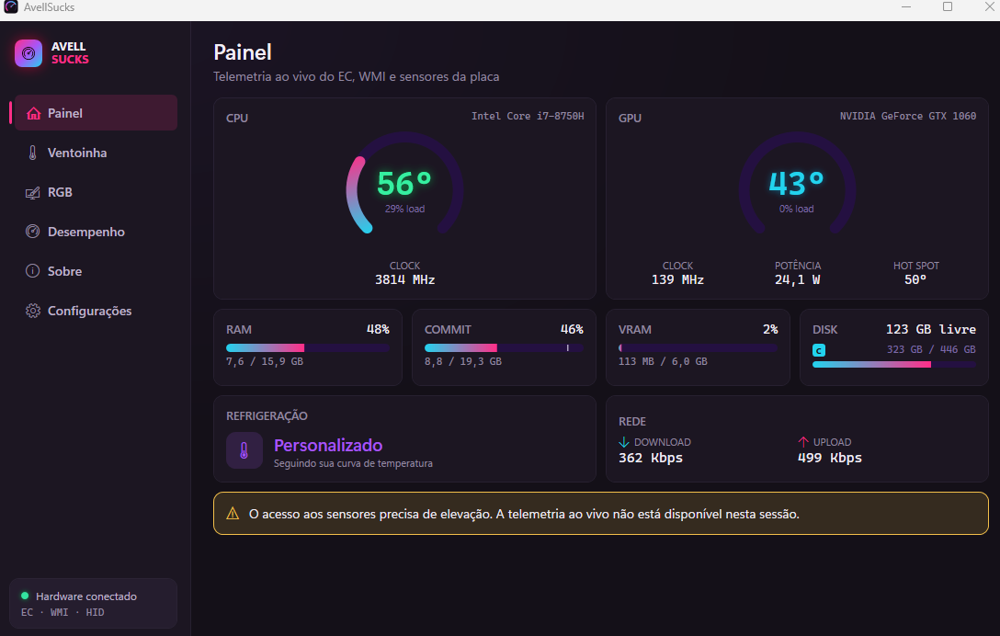

<div align="right">

[English](README.md) · **Português**

</div>

<div align="center">


# AvellSucks

**Um control center não oficial para o notebook gamer da Avell: ventoinha, potência da CPU, plano de energia do Windows e RGB, falando direto com o hardware, com honestidade.**

[](#instala%C3%A7%C3%A3o)
[](https://dotnet.microsoft.com)
[](#)
[](#idiomas)
[](https://github.com/rodrigogs/avell-sucks/actions/workflows/ci.yml)

<sub>Não oficial · sem vínculo com, aprovação de, ou suporte da Avell. Use no hardware para o qual foi feito.</sub>

</div>

<h4 align="center">
  <a href="#por-que-isto-existe">Por quê</a> &nbsp;·&nbsp;
  <a href="#o-que-ele-faz">Recursos</a> &nbsp;·&nbsp;
  <a href="#instala%C3%A7%C3%A3o">Instalação</a> &nbsp;·&nbsp;
  <a href="#como-funciona">Como funciona</a> &nbsp;·&nbsp;
  <a href="#seguran%C3%A7a">Segurança</a> &nbsp;·&nbsp;
  <a href="#compilar-do-c%C3%B3digo">Compilar</a>
</h4>

<div align="center">



</div>

---

## Por que isto existe

Comprei um Avell top de linha em 2018. Quando o Windows 11 ganhou a primeira
grande atualização (a versão 22H2, lançada em **20 de setembro de 2022**, que a
Microsoft manteve por meros **24 meses**), o "Gaming Center" da fabricante, o app
que controla a curva da ventoinha, os modos de desempenho, a iluminação do
teclado, toda a personalidade térmica e de energia da máquina, já estava
**descontinuado e abandonado**: datado, pesado, sem manutenção, e ainda assim a
única forma oficial de controlar o hardware do próprio notebook. Uns quatro anos
de uso, e o software que rodava a minha máquina já estava morto.

Então a escolha era conviver com um bloatware abandonado entre mim e meu próprio
silício, ou substituir. Isto é a substituição. O nome não é sutil de propósito:
ele nomeia o motivo pelo qual o projeto precisou existir.

**O AvellSucks faz o que o app original fazia, melhor e com honestidade:** lê e
escreve nos mesmos registradores do Embedded Controller (EC) que a fabricante
usava, troca os mesmos planos de energia do Windows, e nunca mente sobre se uma
escrita no hardware realmente fixou.

## O teclado (por que o RGB não é testado)

Tem um segundo motivo desse notebook ter deixado um gosto amargo, e é por isso que
a aba RGB sai incompleta e não verificada.

Com uns dois anos de uso, abri a máquina pra limpar. Por dentro, o conector da
fita do teclado estava rachado e preso com um pedaço de fita. Não fui eu. De
fábrica. Foi assim que ele veio.

Nessa época o teclado já estava falhando, e não tinha como consertar de verdade.
Procurei a Avell. Não tinham nada a oferecer, a garantia já tinha vencido, e não
fez diferença o defeito ser deles desde o primeiro dia.

Então o teclado embutido desta máquina não funciona mais. O código da iluminação
RGB (ITE HID) está escrito e ligado na interface, mas não tenho como testar contra
um teclado morto. Ele fica atrás de um estado honesto de "indisponível" até haver
hardware pra provar.

## O que ele faz

- **Ventoinha**: modos (auto, boost, personalizado, L1-L5) e uma curva
  temperatura→PWM personalizada. Aplica ao vivo conforme você edita; sem botão de
  aplicar.
- **Desempenho**: quatro modos (Gaming / Alto / Equilibrado / Economia) que trocam
  o **plano de energia do Windows** ativo e escrevem os bytes de limite de potência
  da CPU (PL1/PL2/PL4).
- **Dispositivos**: controles validados de Wi-Fi + Bluetooth, touchpad I2C,
  webcam, brilho do painel interno e desligamento da tela. As escritas EC do rádio
  têm gate por modelo; touchpad/webcam/brilho usam PnP/WMI com releitura.
- **RGB**: superfície de iluminação do teclado (ITE HID). Interface e contrato
  prontos, mas o backend está incompleto e não testado (veja [acima](#o-teclado-por-que-o-rgb-n%C3%A3o-%C3%A9-testado)).
- **Painel**: carga de CPU/GPU, temperaturas, clocks, memória, disco, rede e o
  perfil de refrigeração ativo, ao vivo, a ~1 Hz — com gráficos de tendência de
  60 segundos de CPU/GPU embutidos nos cards principais.
- **Reativo**: mudanças feitas fora do app (o app antigo da fabricante, a tecla Fn
  física da ventoinha, outro trocador de plano de energia) aparecem aqui em poucos
  segundos. Ele espelha o dispositivo; nunca assume que sua própria última escrita
  ainda é verdade.
- **Configurações**: idioma, iniciar com o Windows, iniciar minimizado, e esconder
  na bandeja ao minimizar. As preferências ficam salvas em
  `%AppData%\AvellSucks\settings.json`.
- **Idiomas**: inglês e português, alternáveis ao vivo em Configurações, sem
  reiniciar. O padrão segue o idioma de exibição do Windows: português num sistema
  pt/pt-BR, inglês no resto. Se você mudar, a escolha fica salva.

<sub>**Marca:** um instrumento de desempenho cyberpunk: *carregado, preciso, vivo*. Neon magenta→ciano sobre violeta-preto profundo.</sub>

## Instalação

> **Requer Windows 10/11 (x64) e direitos de administrador.** O app fala com o
> Embedded Controller e com sensores ring-0, então precisa rodar elevado.
>
> ⚠️ **A escrita no hardware vem LIGADA por padrão e os registradores são
> específicos do Avell i7-8750H para o qual isto foi feito.** Em outro modelo os
> controles de ventoinha/potência podem se comportar mal ou danificar o hardware —
> desligue a escrita em **Configurações → Escrita no hardware** (ou defina
> `GAMINGCENTER_ALLOW_EC_WRITES=0`) antes de mexer neles. Veja [Segurança](#segurança).

1. Baixe o **`AvellSucks-Setup.exe`** mais recente na página de
   [**Releases**](https://github.com/rodrigogs/avell-sucks/releases/latest).
2. Execute. Ele instala per-machine no `Arquivos de Programas`, adiciona um atalho
   no menu iniciar, e registra um desinstalador em *Adicionar ou remover programas*.
3. Abra o **AvellSucks** e aprove o prompt do UAC.

O app verifica o GitHub por versões mais novas e pode se atualizar sozinho em
**Configurações → Atualizações** (baixa o novo instalador e relança em silêncio).

> **Nota, instalador não assinado.** Não há certificado de assinatura de código,
> então na primeira vez que você rodar o `AvellSucks-Setup.exe` o SmartScreen do
> Windows vai dizer *"O Windows protegeu o seu PC / editor desconhecido"*. Clique
> em **Mais informações → Executar assim mesmo**. Isso é esperado para uma
> ferramenta pessoal e não assinada; as atualizações seguintes são aplicadas pelo
> atualizador já confiável, então o aviso só aparece na primeira instalação.

### Iniciar com o Windows

O botão **Iniciar com o Windows** registra uma Tarefa Agendada com *privilégios
mais altos* em vez de uma entrada na chave Run, que é a forma suportada de abrir um
app elevado no logon **sem** um prompt do UAC a cada boot.

## Como funciona

Tudo foi obtido por engenharia reversa do app original descompilado mais muita
cutucada ao vivo no hardware.

### Acesso ao EC: interface de teste WMI ACPI
A fabricante nunca usou um driver próprio. Todo o estado de ventoinha/energia vive
na **RAM do Embedded Controller**, alcançada por um método WMI ACPI em `root\WMI`:
`AcpiTest_MULong.GetSetULong` (instância `ACPI\PNP0C14\1_1`).

- **Leitura:** `Data = 0x100_0000_0000 | addr` (2^40 + addr); o valor de retorno é o byte.
- **Escrita:** `Data = (value << 16) | addr`: **sem flag de leitura** (incluir ela
  faz o EC ignorar a escrita em silêncio; isso custou uma sessão de debug pra achar).

### Registradores confirmados
| Endereço | Significado |
|---|---|
| `0x751` (1873) | byte de controle da ventoinha, 0 auto, 0x40 boost, 0xA0 personalizado, 0x81-0x85 L1-L5 |
| `0x743`-`0x747` (1859-1863) | níveis de PWM personalizados |
| `0x783`/`0x784`/`0x785` (1923-1925) | bytes de ajuste PL1/PL2/PL4 (watts) |
| `0x47B` / `0x7A1` | estado / trigger dos rádios (`0x80` Wi-Fi, `0x20` Bluetooth), somente Avell 1555 |
| `0x730`-`0x732` / `0x734`-`0x736` | padrões de PL Gaming / Office (somente leitura) |

Nesta placa os registradores de PL leem `0`: os limites reais da CPU são geridos
pelo **Intel XTU / MSR**, não pelo EC, então a aba Desempenho mostra os watts
nominais do preset e a alavanca principal do modo é o plano de energia do Windows.

### Planos de energia
Os quatro modos de desempenho mapeiam 1:1 para esquemas dedicados do Windows que a
máquina traz (`MyGamingMode` / `MyHighPerformance` / `MyBalanced` /
`MyPowerSaving`), trocados via `powercfg /setactive`.

### Pipeline de escrita segura
Toda escrita no EC passa pelo `SafeEcWriter`:
**gate → allowlist → snapshot-antes → escrita → verificação por releitura →
rollback em divergência → auditoria JSONL.** Uma escrita bloqueada ou falha aparece
como bloqueada/falha na interface, nunca falseada. As releituras dos registradores
de controle toleram os bits de status transitórios do firmware e tentam de novo com
backoff (o EC engole escritas no meio da transição, principalmente ao sair do Boost).

### Arquitetura
Solução .NET 10 (`app/AvellSucks.Replacement.slnx`):
- `AvellSucks.Core`: contratos de hardware, pipeline de escrita segura, modelos (portável).
- `AvellSucks.Core.Windows`: backends WMI EC, PnP, brilho e energia da tela.
- `AvellSucks.Api` / `AvellSucks.Server`: API de controle ASP.NET local opcional
  expondo `/api/fan/*`, `/api/power/*`, `/api/devices/*`, `/api/system/snapshot`, `/events` (SSE).
- `AvellSucks.UI`: o app WPF (escuro, cyberpunk), telemetria via
  LibreHardwareMonitor, reconciliadores reativos por aba. Localização em tempo de
  execução (`.resx` + um provedor `Loc` e a markup extension `{loc:Tr}`) troca o
  idioma ao vivo; as preferências ficam em JSON sob `%AppData%`, os logs e a
  auditoria de escrita do EC sob `%ProgramData%\AvellSucks`.

## Segurança

> ⚠️ **Sem garantia. Isto pode danificar ou brickar seu notebook. Use por sua conta e risco.**
> Cada registrador aqui foi obtido por engenharia reversa e validado em **uma única
> máquina** — um Avell com Intel **i7-8750H**. Em outro notebook o mesmo endereço de
> EC pode significar outra coisa, e a releitura de verificação ainda vai "confirmar"
> a escrita, porque só checa que o byte entrou, não que era seguro. Escrever limites
> de potência da CPU e bytes crus de EC em ring-0 é exatamente o tipo de coisa que
> pode superaquecer, desestabilizar ou danificar o hardware permanentemente. **A
> escrita vem LIGADA por padrão** (é um control center para a máquina para a qual
> foi feito), então se você está em qualquer outro modelo, desligue *antes* — em
> **Configurações → Escrita no hardware** ou com `GAMINGCENTER_ALLOW_EC_WRITES=0` —
> antes de tocar nos controles de ventoinha/potência.

Isto escreve em registradores de hardware de baixo nível. A allowlist restringe
*quais* pares (endereço, valor) são permitidos; toda escrita é verificada por
releitura, revertida em divergência, e auditada em JSONL. As escritas de limite de
potência e de EC são as pontas afiadas: a interface deixa o estado
gated/bloqueado/falho legível, nunca o esconde. A escrita vem ligada por padrão;
mude para um preview somente-leitura em **Configurações → Escrita no hardware** (ou
force com `GAMINGCENTER_ALLOW_EC_WRITES=0`) se você não está no modelo alvo.

## Acesso remoto & MCP

A API de controle e um servidor MCP podem ser expostos na sua rede para que outros
dispositivos (ou um agente de IA) leiam a telemetria e, se você permitir, alterem
fan/power/dispositivos. É **seguro por padrão**: só localhost, sem autenticação, sem escrita
remota, MCP desligado. Configure tudo em **Configurações → Acesso remoto** — o app
escreve a config (com hot-reload) em `%ProgramData%\AvellSucks\service.json` e o
serviço a recarrega.

Configuração típica:

1. **Executar como serviço em segundo plano** — instala um serviço do Windows que
   mantém a API/MCP disponível com o app fechado.
2. **Expor na rede** — escolha seu IP do **Tailscale** (recomendado) ou um endereço
   da LAN. Deixe em `127.0.0.1` para só localhost.
3. **Gerar token de acesso** — exibido **uma única vez**; copie na hora. Só o hash
   SHA-256 é armazenado. Clientes remotos o enviam como `Authorization: Bearer <token>`.
   Opcionalmente, exija também um certificado de cliente (mTLS).
4. **Habilitar MCP** — serve um servidor MCP via Streamable HTTP em `/mcp` sob a
   mesma autenticação.
5. **Permitir escrita de hardware remota** — desligado por padrão. Clientes remotos
   autenticados podem ler à vontade; só conseguem atuar em fan/power/dispositivos depois que você
   ligar isto.

> ⚠️ Prefira um endereço do **Tailscale**. **Não faça bind em `0.0.0.0`** numa rede
> não confiável — isso expõe a porta a todos que alcançam a interface. Um chamador
> remoto sem token válido (e sem mTLS) é sempre rejeitado (fail-closed), mas uma
> rede overlay privada como o Tailscale ainda é o padrão correto.

Se você deixar o **abrir porta no firewall automaticamente** desligado, adicione a
regra de entrada manualmente (elevado):

```powershell
netsh advfirewall firewall add rule name="AvellSucks Control Service" dir=in action=allow protocol=TCP localport=5055
```

Veja [`docs/api.md`](docs/api.md) para o modelo de autenticação completo, o endpoint
`/mcp` e um exemplo de requisição autenticada.

## Compilar do código

**Requisitos:** Windows no Avell, .NET 10 SDK, rodar **como Administrador** (acesso
a sensores ring-0 + escritas WMI no EC precisam disso). WPF → só Windows.

```powershell
# a partir do diretório app
dotnet build AvellSucks.Replacement.slnx

# rodar o app WPF (elevado)
dotnet run --project src/AvellSucks.UI

# ou o servidor de controle local + API
dotnet run --project src/AvellSucks.Server -- 5055

# testes (233: pipeline de escrita segura, allowlist, gate de escrita, mapa da
# ventoinha, log de auditoria, orquestrador de controles, política de boot-restore)
dotnet test AvellSucks.Replacement.slnx
```

**Publicar um release:** envie uma tag de versão (`git tag v1.2.3 && git push
origin v1.2.3`). O [workflow de release](.github/workflows/release.yml) publica um
build self-contained win-x64, compila o instalador Inno Setup, e anexa o
`AvellSucks-Setup.exe` a um GitHub Release.

**Gate de escrita:** escritas no hardware ficam **ligadas por padrão** (é um
control center para a máquina para a qual foi feito). Desligue em **Configurações →
Escrita no hardware** (persistido) para uma pré-visualização somente-leitura. A
variável de ambiente `GAMINGCENTER_ALLOW_EC_WRITES` força e trava o botão
(`0`/`false` off — preview/demo; `1`/`true` on — também deixa um processo de dev
não elevado ou o pipeline do servidor escrever). *(A variável mantém o nome
original por compatibilidade com o pipeline do servidor.)* Veja o **aviso de
segurança acima**: os registradores são específicos do modelo — não deixe a escrita
ligada se você não está no hardware alvo.

**Nota de performance:** rode a partir de uma cópia em **disco local**, não pelo
caminho UNC do WSL: carregar assemblies por `\\wsl.localhost\...` adiciona ~9 s ao
tempo de inicialização.

## Documentação

- [`docs/ARCHITECTURE.md`](docs/ARCHITECTURE.md): como o app é construído (como foi lançado).
- [`docs/reverse-engineering.md`](docs/reverse-engineering.md): o conhecimento de hardware **validado** — protocolo do EC, registradores confirmados, mapa da ventoinha, planos de energia, e o que foi refutado.
- [`docs/api.md`](docs/api.md): a API HTTP loopback opcional.
- [`docs/design/`](docs/design/): sistema visual + spec do painel. [`docs/adr/`](docs/adr/): registros de decisão. [`docs/runbooks/`](docs/runbooks/): checklist de aprovação de escrita no EC.
- [`docs/evidence/`](docs/evidence/): artefatos brutos de RE (inventário, sondagem do EC, dumps de strings do OEM). [`docs/archive/`](docs/archive/): os logs originais de RE + dossiês de pesquisa.
- `scripts/*.ps1`: scripts reproduzíveis de inventário/sondagem no Windows.

## Licença

Licenciado sob a [Apache License 2.0](LICENSE) — livre para usar, modificar e
redistribuir, com cláusula explícita de **sem garantia / limitação de
responsabilidade** (veja a nota de Segurança acima; este software mexe em hardware
por sua conta e risco).

Projeto pessoal e não oficial. **Sem vínculo com a Avell.** "Avell" e "Gaming
Center" são propriedade de seus respectivos donos; usados aqui apenas para
descrever com o que este software é compatível.
